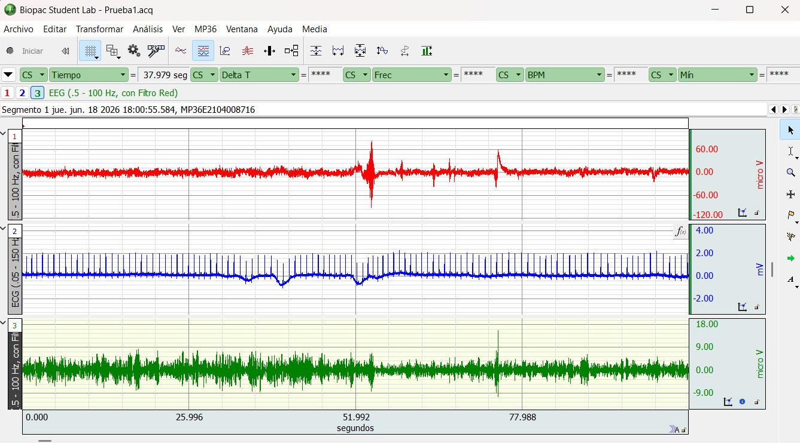
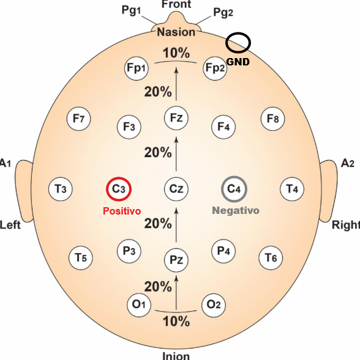
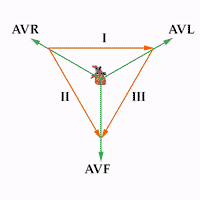

Este apartado documenta los componentes físicos, sistemas de adquisición clínica y las derivaciones de electrodos utilizados para el registro bimodal de biopotenciales.

## 1. BIOPAC MP36
El **BIOPAC MP36** es un sistema de adquisición de datos de grado médico y de investigación diseñado para registrar variables fisiológicas con un alto índice de seguridad y aislamiento eléctrico.
* **Características técnicas:** Cuenta con un convertidor analógico-digital (ADC) de 24 bits, amplificadores de alta ganancia controlados por software y filtros analógicos integrados.
* **Frecuencia de Muestreo ($f_s$):** Configurado a **2000 Hz** (2000 muestras por segundo), garantizando una resolución temporal óptima para evitar el solapamiento de frecuencias (aliasing) en señales de ECG y EEG de acuerdo con el teorema de Nyquist.
* **Conexión:** Los módulos de aislamiento derivan la señal bioeléctrica procesada directamente a la computadora a través de un puerto USB seguro.

* **Canal EEG (Canal 1):** El canal EEG en el BIOPAC es configurado a .5 - 100 Hz.
* **Canal ECG (Canal 2):** El canal ECG en el BIOPAC es configurado a .05 - 150 Hz.

## 2. Derivación Interhemisférica del Electroencefalograma (EEG)
Para registrar de la actividad eléctrica cerebral cortical orientada al Biofeedback, se empleó un montaje simplificado basado en el **Sistema Internacional 10-20**.
* **Configuración Bimodal (Canal 1):** Se utilizo la derivación interhemisférica  **Cz (C3 - C4)** referenciadas al pomul derecho como tierra física.
* **Fisiología del Ritmo Alfa:** Esta ubicación sobre la corteza sensitivo-motora y frontal es idónea para medir la sincronización neuronal. Al cerrar los ojos, el cerebro entra en un estado de reposo metabólico, reflejado en un aumento drástico de la amplitud del **Ritmo Alfa (8 - 13 Hz)**. Al abrir los ojos (estímulo visual), ocurre el fenómeno de desincronización o "Bloqueo Alfa", reduciendo la potencia espectral de inmediato.

.
.

## 3. Derivación II del Electrocardiograma (ECG)
La actividad bioeléctrica cardíaca se registró en el **Canal 2** utilizando la **Derivación II de Einthoven** (derivación bipolar de los miembros).
* **Ubicación de los Electrodos:**
  * **Electrodo Negativo (-):** Brazo derecho (RA - Right Arm), cerca de la muñeca o la fosa antecubital.
  * **Electrodo Positivo (+):** Pierna izquierda (LL - Left Leg), colocado en el tercio inferior del abdomen.
  * **Electrodo de Tierra (GND / REF):** Pierna derecha (RL - Right Leg), actúa como la referencia común del amplificador de instrumentación para suprimir el ruido de modo común.
* **Justificación Biomédica:** La Derivación II sigue el eje eléctrico principal de despolarización del corazón (desde el nodo SA hacia el ápice ventricular, aproximadamente a 60°). Esto produce una **onda R con la mayor amplitud y nitidez posible**, lo cual es un requisito indispensable para que nuestro algoritmo de Pan-Tompkins calcule los intervalos R-R y la Variabilidad de la Frecuencia Cardíaca (HRV) sin errores por falsos positivos.

.
.
