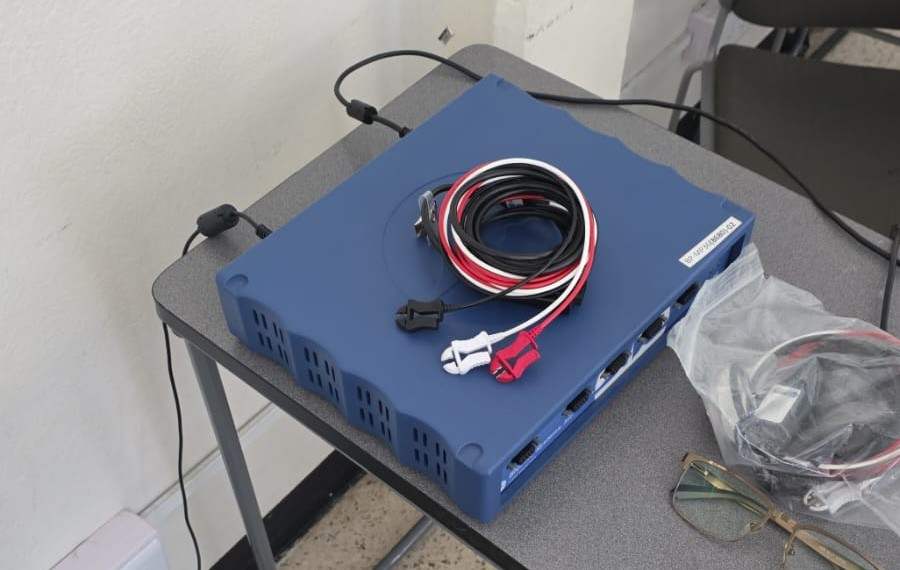

Este apartado documenta los componentes físicos, sistemas de adquisición clínica y las derivaciones de electrodos utilizados para el registro bimodal de biopotenciales.

## 1. BIOPAC MP36
El **BIOPAC MP36** es un sistema de adquisición de datos de grado médico y de investigación diseñado para registrar variables fisiológicas con un alto índice de seguridad y aislamiento eléctrico.
* **Características técnicas:** Cuenta con un convertidor analógico-digital (ADC) de 24 bits, amplificadores de alta ganancia controlados por software y filtros analógicos integrados.
* **Frecuencia de Muestreo ($f_s$):** Configurado a **2000 Hz** (2000 muestras por segundo), garantizando una resolución temporal óptima para evitar el solapamiento de frecuencias (aliasing) en señales de ECG y EEG de acuerdo con el teorema de Nyquist.
* **Conexión:** Los módulos de aislamiento derivan la señal bioeléctrica procesada directamente a la computadora a través de un puerto USB seguro.

